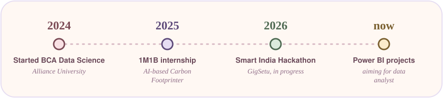
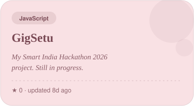
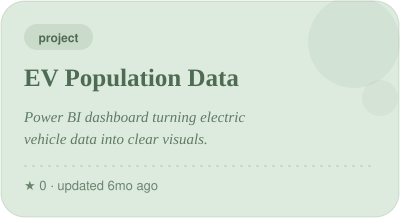
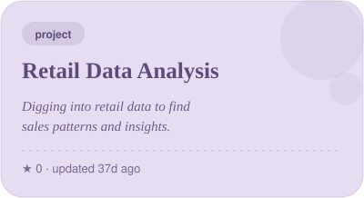
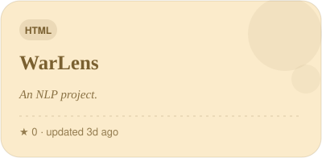
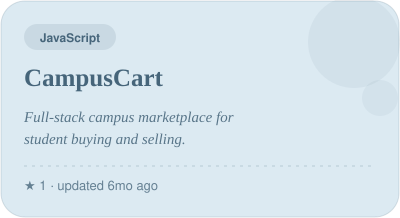

  

  

 

 

## 🕯️ dear visitor,

I'm Pooja, a third-year **BCA Data Science** student at Alliance University, Bangalore. I like quiet evenings, a cup of chai, and the moment a messy dataset finally turns into a chart that makes sense. 🌸

psst, these little dropdowns open when you click them 👇

🌷 <b>more about me</b>

 

- 📊 building data projects in **Power BI** and **Python**
- 🌱 interned with **1M1B** in 2025
- 🎯 looking for **data analyst** internships and opportunities
- 🍳 outside the code: cooking, journaling and morning walks

🎓 <b>certificates</b>

 

Learning from **Meta**, **IBM**, **Salesforce / AICTE**, **DeepLearning.AI**, **Amazon**, **MongoDB**, **University of Michigan** and **University of Illinois**.

📚 <b>tutoring corner</b>

 

3-4 years of teaching maths, science, social and English for **grades 1-12**, across **State, CBSE and ICSE** boards. One-on-one and groups, online and offline.

## 🔭 right now

  

## 📌 my moodboard

these cards update on their own whenever I push to a project 🌷 click one to open it

<!--START_SECTION:projects-->
<table width="100%">
<tr>
<td width="50%" valign="top">

 

</td>
<td width="50%" valign="top">

 

 

</td>
</tr>
</table>
<!--END_SECTION:projects-->

## 📓 recent diary entries

<!--START_SECTION:activity-->
- 🌸 pushed to [**Employee-Attrition-Prediction-**](https://github.com/Pooja27-web/Employee-Attrition-Prediction-) · yesterday
- 🌸 pushed to [**HackerRank-Codes**](https://github.com/Pooja27-web/HackerRank-Codes) · yesterday
- 🌸 pushed to [**Deep-Learning**](https://github.com/Pooja27-web/Deep-Learning) · yesterday
- 🌸 pushed to [**Warlens-Project**](https://github.com/Pooja27-web/Warlens-Project) · 4d ago
- 🌸 pushed to [**LeetCodes**](https://github.com/Pooja27-web/LeetCodes) · 5d ago
<!--END_SECTION:activity-->

## ☁️ the numbers

  

## 🌿 my commit garden

made with 🌸, chai and a lot of late-night notes 
<!--START_SECTION:updated-->
last synced 05 Oct 2026, 12:57 UTC
<!--END_SECTION:updated-->

